# Flutter E-Commerce App
A simple responsive E-commerce app implemented using clean architecture. 

<p float="left">
  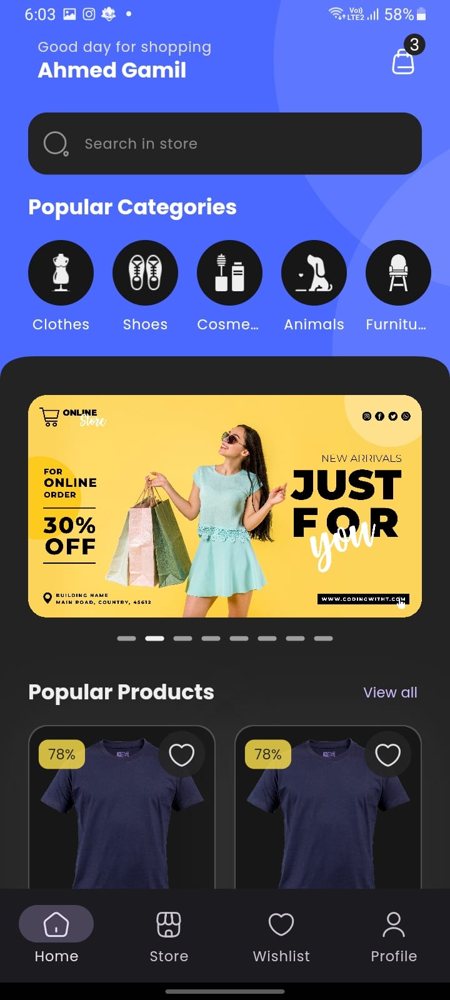
  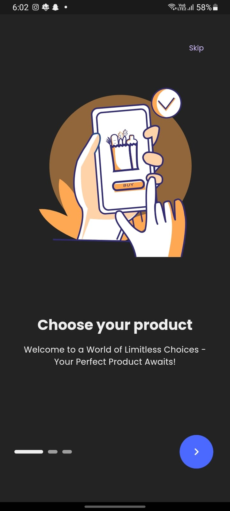
  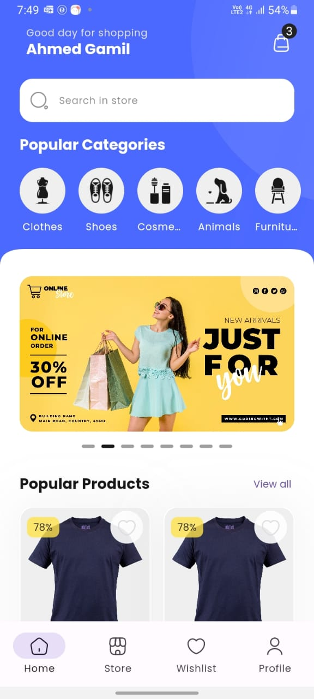
</p>

## Installing
1- Clone the repository
2- Run flutter pub get to install dependencies
3- Run flutter run to start the application

```
git clone
flutter pub get
flutter run
```

## OnBoarding Screens
OnBoarding feature implemented for users who open the application for the first time only

<p float="left">
  
  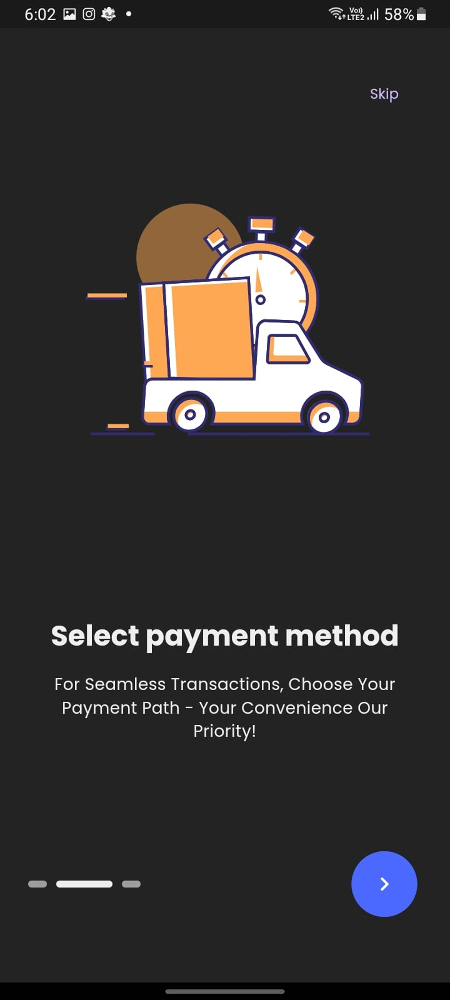
  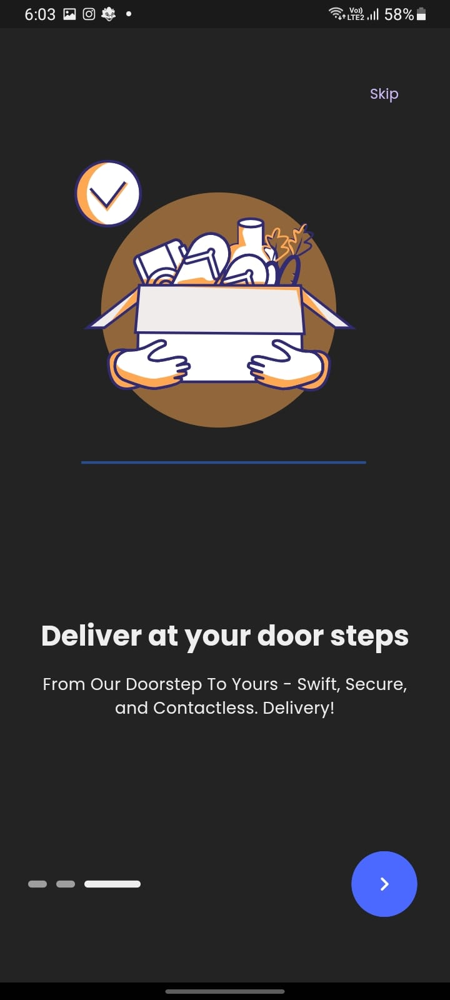
</p>


## Authentication
Authentication is implemented using fireAuth by a firebase service

<p float="left">
  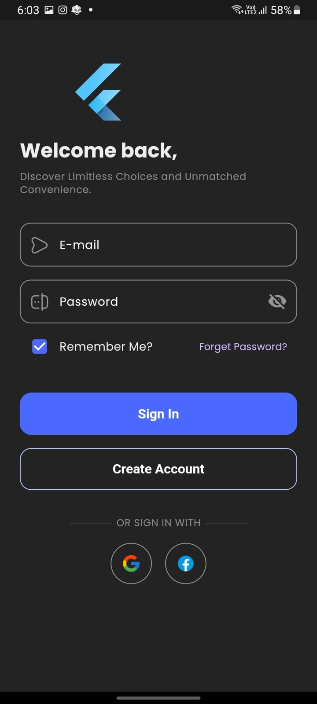
  
</p>

## Main Pages

<p float="left">
  
  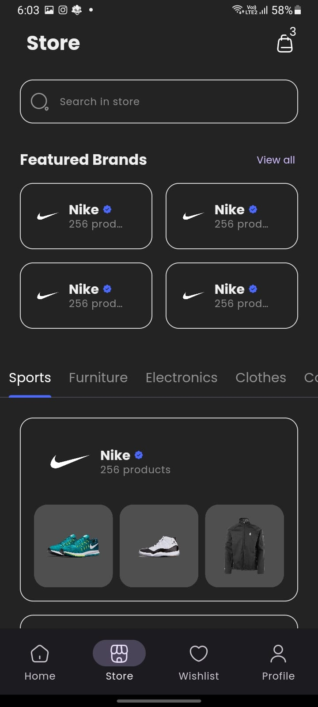
  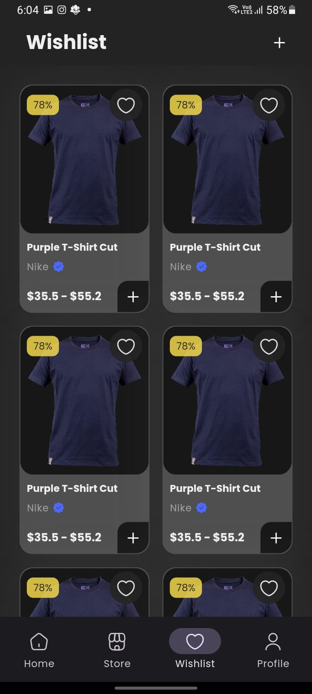
  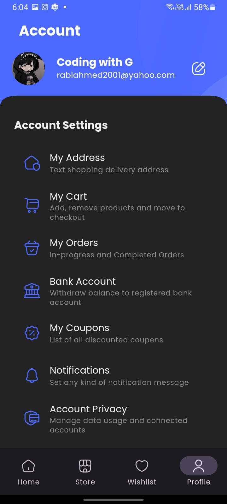
</p>

## Product Detail 

<p float="left">
  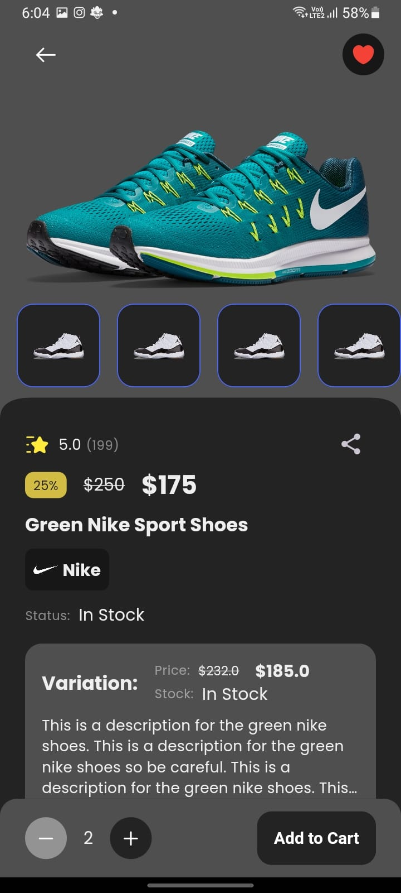
  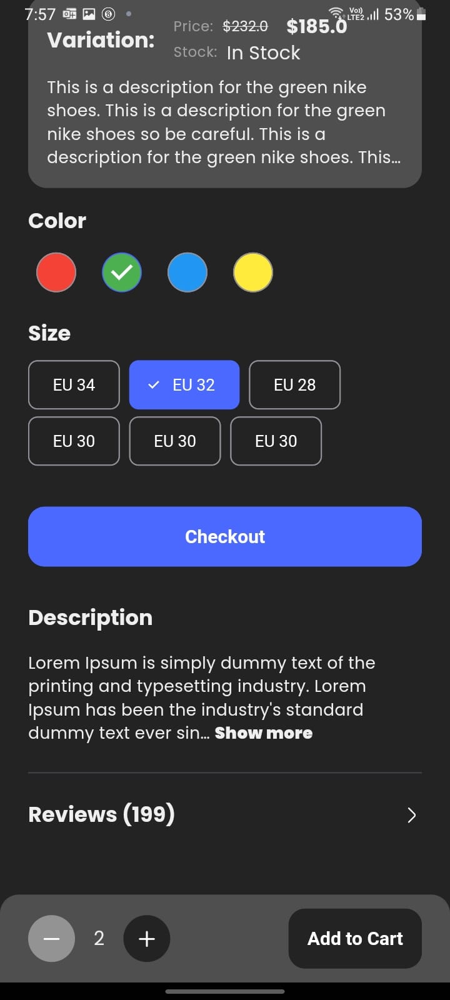
</p>

## Reviews 

<p float="left">
  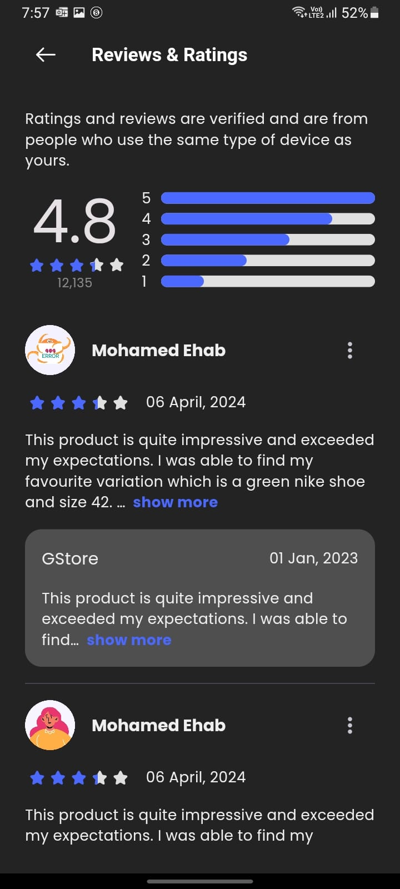
  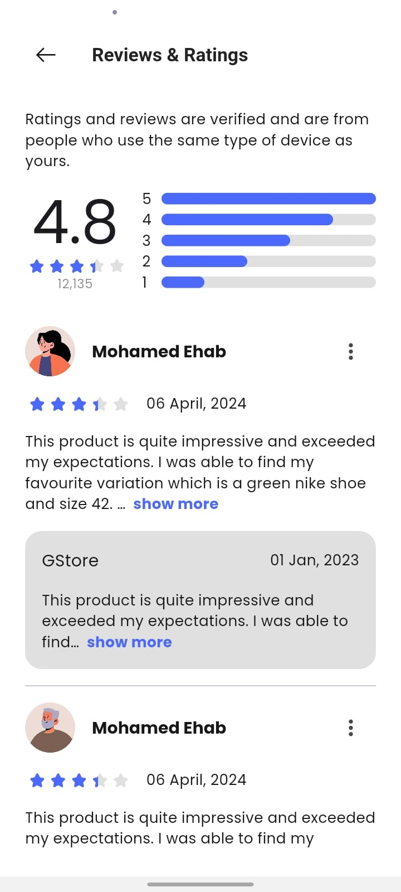
</p>

# Ongoing Features
- Backend Integration
- Adaptiveness
- Notifications
- Payments using credit/debit cards
